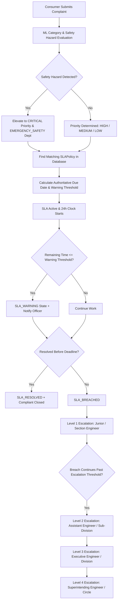

# GrievanceHUB — MSEDCL SLA Engine Specification & Architecture

This document specifies the database-driven, configurable Service Level Agreement (SLA) Engine implemented for GrievanceHUB in the Maharashtra State Electricity Distribution Company Limited (MSEDCL / Mahavitaran) domain.

---

## 1. SLA Engine Overview

The GrievanceHUB SLA Engine provides continuous compliance tracking, real-time warning thresholds, hierarchical utility escalations, pause/resume tracking, immutable audit trails, and automated background execution.

Unlike static systems, SLA rules in GrievanceHUB are **configuration and database-driven**, matching complaints based on:
```text
Priority + Category + Department + Service Area
```



---

## 2. Policy Matching Hierarchy

SLA policy selection is resolved hierarchically by `find_matching_sla_policy()`:
1. `Priority + Category + Department + Service Area` (most specific)
2. `Priority + Category + Department`
3. `Priority + Category`
4. `Priority Only` (general tier fallback)

### Default MSEDCL Baseline Policies (Database-Driven)

| Policy Name | Priority | Category | Target Minutes | Warning Threshold | Escalation Interval | Utility Escalation Tier 1 |
|---|---|---|---|---|---|---|
| **Emergency Electrical Safety Hazard** | `CRITICAL` | Pole / Wire / Electrical Hazard | 120m (2 hours) | 30m remaining | 1 hour overdue | Junior Engineer |
| **High Voltage Transformer Breakdown** | `HIGH` | Transformer Fault | 720m (12 hours) | 120m remaining | 3 hours overdue | Junior Engineer |
| **Area Power Outage Supply Restoration** | `HIGH` | Power Outage / No Supply | 480m (8 hours) | 120m remaining | 2 hours overdue | Junior Engineer |
| **Voltage Quality & Fluctuation** | `MEDIUM` | Voltage Fluctuation | 1440m (24 hours) | 240m remaining | 6 hours overdue | Junior Engineer |
| **Billing & Commercial Discrepancy** | `LOW` | Billing & Metering | 4320m (72 hours) | 480m remaining | 24 hours overdue | Junior Engineer |

*Note: Clock type defaults to `CONTINUOUS_24H` (24-hour continuous grid operations clock) suitable for critical electric utility operations.*

---

## 3. SLA Lifecycle States

Every grievance tracks its SLA status through the following lifecycle states:
- `NOT_STARTED`: Complaint submitted, awaiting policy binding.
- `ACTIVE`: Policy bound, due date calculated, countdown in progress.
- `WARNING`: Remaining time has reached or passed `warning_minutes` threshold.
- `BREACHED`: Current time has passed `due_at` deadline.
- `PAUSED`: Countdown clock suspended due to approved operational delay.
- `RESOLVED`: Field resolution submitted by authorized engineer before or after breach.
- `CLOSED`: Consumer confirmed resolution or administrative closure.

---

## 4. Hierarchical Utility Escalations

When a complaint breaches its SLA deadline, it is escalated along the MSEDCL organizational hierarchy:

1. **Level 1**: Section / Junior Engineer (JE) — Immediate field response officer.
2. **Level 2**: Assistant Engineer (AE) / Sub-Division In-charge — Operational management.
3. **Level 3**: Executive Engineer (EE) / Division Head — Administrative intervention.
4. **Level 4**: Superintending Engineer (SE) / Circle Officer — Circle-level oversight.

*(Note: Replaces civic "Ward Supervisor" municipal remnants).*

### Escalation Idempotency Guarantee
When background schedulers or management commands execute periodically, the system enforces database-level uniqueness on `(grievance, escalation_level)` via `unique_grievance_escalation_level`. Repeated executions will **never** generate duplicate escalation records for the same level.

---

## 5. SLA Pause & Resume Mechanism

Officers cannot arbitrarily stop the SLA clock. Pausing is permitted solely for system-defined operational conditions:
- `WAITING_FOR_CONSUMER`: Awaiting consumer confirmation or premise access.
- `MATERIAL_REQUISITION`: Transformer, conductor, or pole requisition from central stores.
- `PERMIT_PENDING`: Statutory road-digging or municipal excavation clearance pending.
- `SAFETY_CLEARANCE`: Upstream grid isolation or safety hazard clearance required.
- `WEATHER_EMERGENCY`: Severe monsoon or grid storm emergency.

Every pause logs:
- `paused_at`: Timestamp clock was stopped.
- `paused_by`: Authenticated officer who requested pause.
- `pause_reason`: Specific reason code and notes.
- `resumed_at`: Timestamp clock was restarted.
- `total_paused_seconds`: Cumulative seconds paused, automatically extending `due_at`.

---

## 6. Background Batch Processing

A reliable Django management command executes the SLA evaluation:
```bash
python manage.py process_sla
```

### Operation:
1. Queries all active grievances (`ASSIGNED`, `IN_PROGRESS`, `REOPENED`, `ESCALATED`, etc.).
2. Evaluates time remaining against policy target and warning threshold.
3. Marks warnings and breaches in database.
4. Creates hierarchical escalation records idempotently.
5. Dispatches notifications to assigned officers.
6. Records immutable `AuditLog` events (`SLA_WARNING`, `SLA_BREACHED`, `SLA_ESCALATED`).

---

## 7. Real Analytics & Dashboard KPIs

SLA metrics are queried directly from the database using Django ORM aggregations (`Count`, `Avg`, `Q`):
- `total_active_complaints`
- `sla_compliant`
- `sla_warning`
- `sla_breached`
- `currently_escalated`
- `compliance_rate`
- `department_compliance` breakdown
- `average_resolution_hours`

Zero synthetic or fake analytics data is fabricated in production views.

---

## 8. Implemented vs Planned Features

### IMPLEMENTED
- [x] Configurable `SLAPolicy` model with target minutes, warning minutes, priority, category, department, and 24-hour clock.
- [x] Hierarchical `find_matching_sla_policy` with exact-to-general matching.
- [x] Automatic calculation of `due_at` and `warning_at`.
- [x] State transitions (`ACTIVE`, `WARNING`, `BREACHED`, `PAUSED`, `RESOLVED`).
- [x] MSEDCL Utility escalation hierarchy (Junior Engineer -> Assistant Engineer -> Executive Engineer -> Superintending Engineer).
- [x] Database-level idempotency constraint preventing duplicate escalation records.
- [x] SLA Pause/Resume operational workflow with duration tracking and deadline extension.
- [x] Management command `python manage.py process_sla`.
- [x] Real-time ORM aggregation API `/api/sla/overview/`.
- [x] Officer Work Queue SLA badges, countdown/overdue indicators, and progress bars.
- [x] Consumer Dashboard non-technical expected resolution and escalation notices.
- [x] 100% Passing Automated Test Suite (30/30 tests).

### PLANNED / OUT-OF-SCOPE
- [ ] Direct live telemetry integration with MSEDCL SCADA / Outage Management System (OMS) (Requires authorized MSEDCL internal API gateway).
- [ ] SMS Gateway integration with CDAC / NIC bulk SMS gateway (Requires production telecom credentials).
- [ ] Enterprise Redis/Celery periodic scheduler cluster (Designed to plug into `process_all_active_sla`).

---

## 9. Domain Notice
> **Important**: Official MSEDCL consumer-number verification and live SCADA feeder telemetry require an authorized MSEDCL enterprise integration. In this implementation, structural 12-digit validation and internal database uniqueness are enforced.
